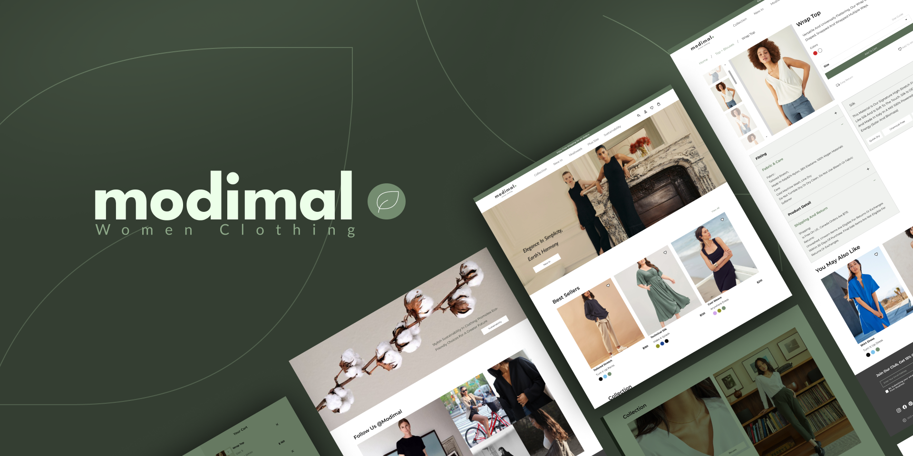

# E-commerce-clothing-women

<p align="center">

</p>

<h4 align="center">
    <a>
    <a href="https://e-commerce-clothing-women.vercel.app/">Demo</a>
    <a>
    <span>| </span>
    <a href="https://www.figma.com/file/ZeLE58eDZ0inDuZylNmYoR/modimal---Women-Clothing-Website-(Community)?type=design&node-id=3493%3A18384&mode=design&t=uzULGndcCqSJQ9pe-1">Figma source Design</a>
</h4>

<p align="center">

</p>

<h4 align="center">
   Modimal is a Women clothes Online shop  implemented with Next.js and TypeScript. Styled with TailwindCSS. 
</h4>

<div align="center">


</div>


## Featuers

- [x] using Redux Toolkit as State manager
- [x] Using Supabase for manage DataBase
- [x] Fully Responsive with Material UI
- [x] Using TypeScript for code safety
- [x] Using Custom Hooks for code reusability and maintainability
- [x] Utilizing the latest Next.js framework to improve Server-Side Rendering (SSR), Client-Side Rendering (CSR), and optimization features like image and font handling
- [x] Authentication and User Account with Express js
- [x] add WishList page for view what user liked
- [x] view cart and store on LocalStorage
- [-] Using starpi for Checkout page for successfull payment and error handling


## Usage

1.First you should clone the project

```jsx
git clone https://github.com/itsnooshin/E-commerce-clothing-women.git
```

2.Install project dependencies

```jsx

npm run dev
# or
yarn dev
```


## 💬Contact Me

   <p dir="auto" style="display: flex; center; gap: 10px;">
  <a href="https://www.linkedin.com/in/nooshin-bakhtiari-62378520b/">
    
  </a>
  <a href="mailto:nooshindev@gmail.com">
    
  </a>
</p>
